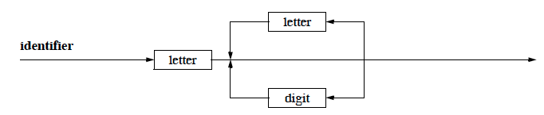
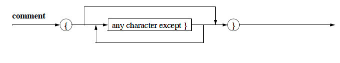

#Identifiers
##  Objects in a pascal program:

	* constants
	* types
	* variables
	* procedures
	* functions

They all need unique identifiers.

## Pascals allows characterset:

**Letters**
````
A B C D E F G H I J K L M
N O P Q R S T U V W X Y Z
a b c d e f g h i j k l m
n o p q r s t u v w x y z
````
**Digits**

````
	0 1 2 3 4 5 6 7 8 9
````

**Special Symbols**

````
+       -       *       /
.       , 		:       ;
=       <> 	    < 		<= 	    > 		>=
:=      .. 	    ^ 		'
(       ) 		[ 		] 		{       }
````

**Reserved Words**

````
and array begin case const div do
downto else end file for function
goto if in label mod nil not of or
packed procedure program record repeat
set then to type until var while with
````

**The Syntax Diagram for an identifier:**


Note:
* `LongWord` and `longword` are identical identifiers.
* Some pascal implementations only evaluate the first 8 characters of an identifier and in some cases: `FoooBaar` and `FoooBaario` are identical.
* **standard identifiers** are already defined. For example: `output` and `writeln`
* *identifiers*, *numbers*, and *reserved words* need to be seperated by either a whitespace or an end-line-character, called *seperaters*.
* **comments** are also valid *seperators*, althought the actual usecase is to leave behind useful information for the programmer. For example
````pascal
program SehrEinfach (output);
{ 	Dies ist das erste Programm-Beispiel
	im Kurs 1613 }
begin
	writeln ('Hallo! Viel Spaß beim Programmieren!')
end.
````

**The Syntax Diagram for a comment:**

