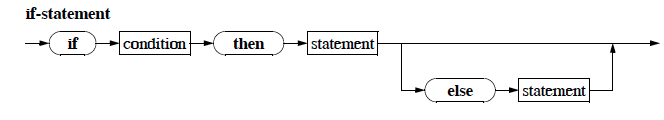

# Conditional Statements

They're pretty awesome, and allow what is refered to as *branching*

* *Conditional Statements* have many uses:
    * Check that the user input fulfils some preconditions.
    * Controls the execution of the code depending on user input

**The Syntax Diagram for an if-statement:**


* The *condition* has to be a *boolean expression*
* In the simple form the *condition* is followed by the `then` *reserved word* and the statement that is to be executed if the *condition* evaluates to `true`.
* In the extended version, the statement following the `else` *reserved word* is executed if the *condition* evaluates to `false`.

### The Three most common mistakes while writing *if-else-conditional-statemetns*:

#### Wrong Empty Statement:

````pascal
if <condition> then; { Error }
    write (something)
````
due to the simicolon after the `then` reserved word, the compoiler will consider the *empty statment* to be belonding to the conditional. The `write (something)` statement will not belong to it anymore, and will be executed anyway.

#### Missing begin-else

Another common mistake is forgetting the `begin` and `end` reserved words if you want to use a *compound statement*.

````pascal
if <condition> then
    write (something); { Error: no `begin/end` }
    write (somethingMore);
````
In this case on the first write statement belongs to the if-statement. The other write will be executed regardless of whether the conditional is `true` or `false`.

#### Semicolon before `else`

````pascal
if <condition> then
    write (something);
else                        {Error: simicolon before else}
    write (somethingMore)
````
due to the semicolon the if-statement ends before the else part can begin.

### Chaining `if`-statements

````pascal
program BulkDiscount (input, output);
{ Give a discount if more than 10 are being bought
    and a bigger discount if more than 50 are being sold}

    const
    BASEPRICE = 200.00 {Bitcoin};

    var
    ammount : integer;
    price : real;

begin
    writeln ('Input the ammount of ordered', 'items:');
    readln (ammount);
    if ammount > 0 then
    { then an order has been placed }
    begin
        price := ammount * BASEPRICE;
        if ammount > 10 then
            { client will get a dicount }
            if ammount > 50 then
                { big discount }
                price := price * 0.8� 0.8
            else
                { small discount }
                price := price * 0.9;� 0.9;
        writeln ('The total price is  ', price, ' Bitcoin')
    end
    else
        writeln ('faulty input')
end. { Verkauf1 }
````
