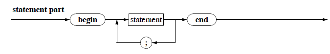
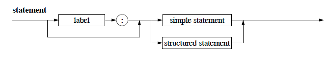
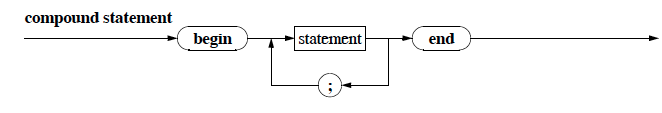

# Describing The Actions

**The Syntax Diagram for the statement part:**


* After the *decleration part* defines the *constants* and *types* and declares the *variables* the *statement part* offers the *statements* that will use and minipulate the above.
* Pascal is also refered to as a *sequential* programming language, since the statements are always executed one after the other, and never in parallel.
* Taking the Circumfurance program as an example again:

````pascal
program Circumfurance (input, output);
{ calculate the circumfurance with a given radius }

const
PI = 3.141592654;

var
Radius,
Umfang : real;

begin
	writeln ('Calculating the circumfurance.');
	write ('Input the radius: ');
	readln (Radius);
	Circ := 2.0 * PI * Radius;
	writeln ('The circumfurance: ', Circ)
end. { Circumfurance }
````
* Pascal offers both *simple statements* as well as *structured statements*.

**The Syntax Diagram for a statement:**


* Using the label is an indication of a poor programming style, and we will be completely ignoring it.

## Simple Statments

**The Syntax Diagram for a statement:**


* The *empty statement* is the simplest statements, and is represented by a straight line in the above syntax diagram. Its used for structuring the code visually.
* The most important statement is the *assignment statement* is a hallmark of all imperative programming. It looks like this `x := expr`
* `x` is the identifier of a variable, `expr` is an *expression* and what we are saying is "`x` has the value `expr`" or "`expr` is assigned to `x`"
* `:=` is called the *assignment operator*, where both the variable and the expression need to be of the same datatype.
    * The only exception of this rule is assigning an `interger` expression to a `real` variable, since Pascal offers *implicit type conversion* for `integer` into `real`.
* The expression can be a combination of variables, constants, function calls, operators and parenthesis. The expression is *evaluated* and assigned to the variable.
* The order is which operators get executed in an expression, unless explicitly indicated by parenthesis:


| priority | Class | Operator |
| -- | -- | -- |
| highest priority | 1 | `not` |
|  | 2 | `* / div mod and ` a.k.a. dot operators|
|  | 3 | `+ - or` a.k.a line operators |
| lowest priority | 4 | `= <> < <= > >=` |

Keep the following in mind as well:
* Every variable in an expression needs to have some value assigned to it before it gets evaluated, otherwise the evaluation is undefined.
* Excessive use of parenthesis is never harmful. When in doubt, use them. Mostly they will also make reading the code easier.
* Boolean expressions will get fully evaluated in Pascal, even if the first part is enough to define it. Turbo and Free Pascal stop evaluation once a conclusive value has been reached.
* rewriting boolean expressions is one of the biggest sources of error in coding. Be extra careful when doing so.

### Compound Statements

* A *sequence* of statements seperated by a semicolon are called a *compound statement*.
* `begin` and `end` are used almost as parenthesis for compount statements, and so a *compound statement* in pascal has the form:

**The Syntax Diagram for a statement:**


* The *statement part* of a program has the same syntax as a *compound statement*.
* The following is a valid *compound statement*:

````pascal
begin
    x := 1;
    x := x + 1;
    begin
        y := false;
        y := x > 0;
    end;
    begin
    end;
    x := x * x - 1;
    ;
    ;
    y := x > 4
end
`````


## Standard In- and Output

We will not tackle the the technical details of system specific input and output, which is beyond the scope of this book. Refer to a python handbook for that.


* `read` and `readln` are used for input
* `write` and `writeln` are used for output.
* the above are neither *simple statments* nor are they *compound statements*, they are *special statements*.

### The `read` statement
* Used to read `char`, `integer` and `real` values.
* Has the form `read (x1, x2, ..., xn)` where x1 to xn are the *parameters* and are the variables to which the values will be assigned.

 **example**:

Taking into consideratiosn the following decleration part:

````pascal
var
i,
j : integer;
x,
y :real;
c :char;
````

and using the following statement to read the values:

````pascal
read (c, i , x, j ,y)
````

````pascal
A 1 123.45 6 -7.9810
````

the variables would have the values:

````pascal
i = 1
j = 6
x = 123.45
y = -79810
c = A
`````

### The `readln` statement

The only difference to the above `read` statement is that the cursor would go to a new line after every read.

### The `write` statement

* Has the form `write (A)`
* `A` can have either of the following forms:

````pascal
    x
    x:b
    x:b:k
````
* `x` is an expression of type `char`, `integer`, `real`, or `string`.
* `b` is an `integer` expression that designated the minimum field length of the output. (useful for drawing tables)
* `k` may only be used if `x` is a `real` expression. It designated the number of decimal points that are sent to the output.

````pascal
begin
write (a1);
write (a2);
...;
write (an)
end
````
can also be expressed as `write (a1, a2, ..., an)`

### The `writeln` statement

* Places the curson on a new line when done outputing.
* Can be used without parameters and would then simply push the curser to a new line.

Putting all of the above together we can write a little program:

````pascal
program BitcoinAmmount (input, output);
{ Returns the ammount in Bitcoin }
    const
    CURRENCY = 'Bitcoin';

    var
    value : real;

begin
    write ('Please insert the');
    write (' ammount in ', CURRENCY, ':');
    readln (value);
    write (value:9:2, CURRENCY)
end. { BitcoinAmmount }
````
would have the following output:

````
Please inser the ammount in Bitcoin: 1234567e-3
    1234.57Bitcoin
````

