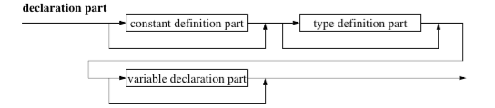
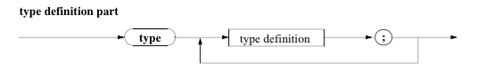
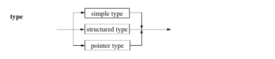
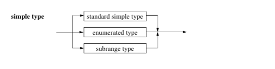
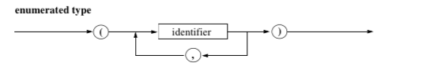
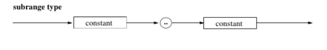

# Simple Self-defining DataTypes

* **The Decleration Part including type declerations:**


* **The Type Definition Syntax Diagram:**


* Type identifierst should always start with the character `t`, like `tCar` or `tPotatoe`.

* **We identify 3 different types:**


* **The Simple Types:**

* The *Standard Simple Types* are the already described `integer`, `real`, `boolean`, and `char`

## Enumerated Type:

* **The Enumerated Type:**


````pascal
    type
    tFahrzeug = (LKW, PKW, Bus, Zug);
    tZeitabschnitt = (Tag, Woche, Monat, Jahr);
    tFarbe = (rot, gruen, blau, gelb, rosa, braun);
    { The bellow type is considered invalid }
    tZiffer = (0, 1, 2, 3, 4, 5, 6, 7, 8, 9);
````
* The enumarables are ordered according to their position in the decleration, and so:

````pascal
    ord (rot); { 0 }
    ord (blau); { 2 }
    Tag < Jahr; { would return true }
````

## Subrange Type:

* **The Subrange Type:**

* Is used to declare subranges of already existing ranges.
* Predefined constants are used in the definition.

````pascal
  type
  tMinute = 0..59;
  tPlusMinus10 = -10..+10;
  tFarbe = (rot, gruen, blau, gelb, rosa, braun);
  tFarbausschnitt = rot..blau;

  var
  Uhr : tMinute;
  Intervall : tPlusMinus10;
  Testzahl : integer;
  FarbtonGross : tFarbe;
  FarbtonKlein : tFarbausschnitt;
````
* The bellow statements would not cause runtime errors:

````pascal
    Testzahl := Intervall;
    Testzahl := Uhr;
    FarbtonGross := FarbtonKlein;
````

* The bellow statements **would** cause runtime errors:

````
    FarbtonKlein := FarbtonGross;
````

* Pascal allows implizit Type definitions in the program block. This is considered bad programming style and it is recomended that we avoid it.
