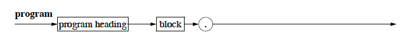
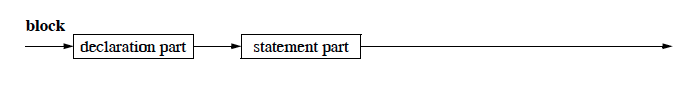

# Introduction to Imperative Programming
	
## Pascal Part 1

### Introduction

Reminder/disclaimer: This course is not about teaching Pascal as much as it is about teaching the fundamentals of imperative programming.

*The workflow for writing a program:*
* Write "paper code", train your mind to simulate a computer.
* Use an *Editor* to write a code and save it to a *file*
* The *source code* is then checked for syntax and semantic errors by the compiler
* The compiler translated the code to machine-language.

## Program Structure

Syntax Diagrams were introduced along with PASCAL. 

**Principles of Syntax Diagrams:**
>The representation of a grammar is made of a set of syntax diagrams. Each diagram defines a *non-terminal*. There is a main diagram which defines the language in the following way: to belong to the language, a word must describe a path in the main diagram.
Each diagram has an entry point and an end point. The diagram describes possible paths between these two points by going through other *non-terminals* and *terminals*. Terminals are represented by round boxes while nonterminals are represented by square boxes.

**The Syntax Diagram for Pascal programs:**


**The Syntax Diagram for Pascal program heading:**


**The Syntax Diagram for Pascal program block:**


**The Syntax Diagram for Pascal program statement-part:**


**A very simple pascal program:**
````pascal
program VerySimple (output);
begin
	written ('Hello! Hope you enjoy learning to code!')
end.
````

* The above prgram is called VerySimple
* the identifier `output` indicated that the data output should go to *standardout*, usually the screen.
* The *decleration part* is empty in this case
* The *statemenet part* contains the output-instruction `writeln` which a *standard procedure* in pascal and doesnt need to be declared.

## Indentifiers


