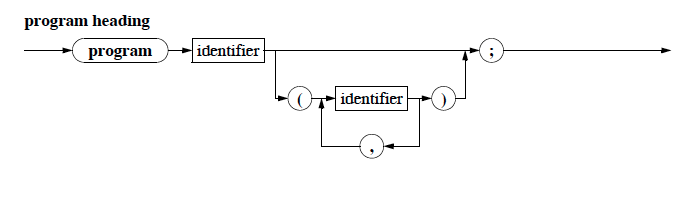
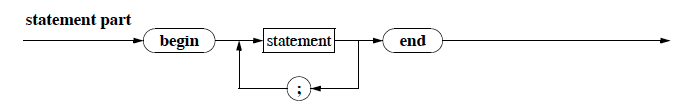
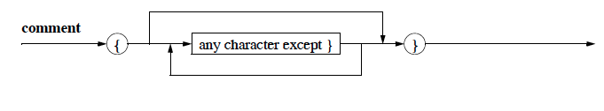

# Introduction to Imperative Programming
	
## Pascal Part 1

### Introduction

Reminder/disclaimer: This course is not about teaching Pascal as much as it is about teaching the fundamentals of imperative programming.

*The workflow for writing a program:*
* Write "paper code", train your mind to simulate a computer.
* Use an *Editor* to write a code and save it to a *file*
* The *source code* is then checked for syntax and semantic errors by the compiler
* The compiler translated the code to machine-language.

### Program Structure

Syntax Diagrams were introduced along with PASCAL. 

**Principles of Syntax Diagrams:**
>The representation of a grammar is made of a set of syntax diagrams. Each diagram defines a *non-terminal*. There is a main diagram which defines the language in the following way: to belong to the language, a word must describe a path in the main diagram.
Each diagram has an entry point and an end point. The diagram describes possible paths between these two points by going through other *non-terminals* and *terminals*. Terminals are represented by round boxes while nonterminals are represented by square boxes.

**The Syntax Diagram for Pascal programs:**


**The Syntax Diagram for Pascal Program Heading:**


**The Syntax Diagram for Pascal program block:**


**The Syntax Diagram for Pascal program statement-part:**


**A very simple pascal program:**
````pascal
program VerySimple (output);
begin
	written ('Hello! Hope you enjoy learning to code!')
end.
````

* The above prgram is called VerySimple
* the identifier `output` indicated that the data output should go to *standardout*, usually the screen.
* The *decleration part* is empty in this case
* The *statemenet part* contains the output-instruction `writeln` which a *standard procedure* in pascal and doesnt need to be declared.

### Indentifiers

#### Objects in a pascal program: 

	* constants
	* types
	* variables
	* procedures
	* functions

They all need unique identifiers.

#### Pascals allows characterset:

**Letters**
````
A B C D E F G H I J K L M
N O P Q R S T U V W X Y Z
a b c d e f g h i j k l m
n o p q r s t u v w x y z
````
**Digits**

````
	0 1 2 3 4 5 6 7 8 9
````

**Special Symbols**

````
+		- 		* 		/
. 		, 		: 		;
= 		<> 	< 		<= 	> 		>=
:= 	.. 	^ 		'
( 		) 		[ 		] 		{ 		}
````

**Reserved Words**

````
and array begin case const div do
downto else end file for function
goto if in label mod nil not of or
packed procedure program record repeat
set then to type until var while with
````

**The Syntax Diagram for an identifier:**


Note:  
* `LongWord` and `longword` are identical identifiers.
* Some pascal implementations only evaluate the first 8 characters of an identifier and in some cases: `FoooBaar` and `FoooBaario` are identical.
* **standard identifiers** are already defined. For example: `output` and `writeln`
* *identifiers*, *numbers*, and *reserved words* need to be seperated by either a whitespace or an end-line-character, called *seperaters*.
* **comments** are also valid *seperators*, althought the actual usecase is to leave behind useful information for the programmer. For example
````pascal
program SehrEinfach (output);
{ 	Dies ist das erste Programm-Beispiel 
	im Kurs 1613 }
begin
	writeln ('Hallo! Viel Spaß beim Programmieren!')
end.
````

**The Syntax Diagram for a comment:**


### Numbers

Pascal supports two different types of numbers.

#### `integers`
**The Syntax Diagram for a comment:**


* The limit to the number of digits allowed in an integer is imposed by the memmory cell.
	* 16 bit(2byte) would allow 2^16 integer numbers to represented.
	* Half of the representable numbers would be allocated to the positive numbers, including zero. The other half for the negative numbers.
	* `maxint` is a standard-identifier for the largest representable integer. for 15 bit systems, this would be: `2^15 - 1 = 32767`
	* All intergers lie in the interval: `I = [-maxint - 1, maxint]`

#### `real`

* **real** numbers are Floating point numbers. For more details on floating point arithmetic see: https://en.wikipedia.org/wiki/Floating_point
* A floating point is described as: `f = m•b^e` where f is the number, *m* is called the *mantise*, *b* is the *base*, and *e* is the *exponent*
* Due to the limited storage capacity of memmory cell, there are limitation on the numbers that **real** numbers can represent. 
* The limitation on the decimal digits results in round-off errors. For more information see https://en.wikipedia.org/wiki/Round-off_error. For example, taking the base as 10, and asusming a 4 digit limit on the manstise and a 2 digit limit on the exponent:
	* ````pascal
( 2000 + 0.7 )– – 2000	= ( 2.000·10^3 + 7.000·10^(-1) ) –– 2.000·10^3
							= ( 2.000·10^3 + 0.000·10^3) –– 2.000·10^3
							= 0
(2000 –– 2000) + 0.7 	= (2.000·10^3 – 2.000·10^3) + 7.000·10^(–– 1)
							= 0.0000·10^0 + 7.000·10^(–1)
							= 7.000·10–^(–1)
							= 0.7
````
	* the adition and subtraction is done on the mantise, and therefore the base and exponent need to be equal.
* There are two ways to express **real** numbers in pascal:
	* *fixed point form*. Examples: `0.0, 0.123, -12.3 and 12.34567` and not `0., .12,`
	* *denormal* or *non-normalized floating points*: `0E0, 1.23E+04, 123E-4 and 0.12345678E9`

**The Syntax Diagram for a real numver:**


