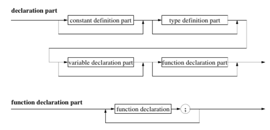
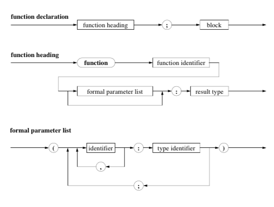
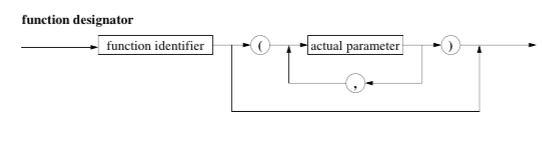

# Functions

* `y / sqrt (x) + 3.0` contains the standard function `sqrt`, and calls it on `x`
*
* **The Function Declaration Part Syntax Diagram:**

* **The Function Declaration Syntax Diagram:**


````
function max (x, y : real): real;
{ determines the larger of both x and y  }

begin
    if x > y then
        max := x
    else
        max := y
end; { max }
````

* The decelrations made in the decleration part of the function block are *local* and not defined outside the function block.
* Variables' lifetime is restricted to the execution of the function.
* **The Function Call Syntax Diagram**

* Standard functions like `sqr, abs, pred, succ` can accept different types as parameters, and will behave differetly for each. This is not possible for self defining functions.
* 
