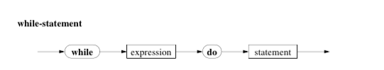

# Loops

Like all imperative languages Pascal has its own **loop statements**:
* `repeat`
* `for`
* `while`

## The `for` statement

* **The For Syntax Diagram:**

* The identifier is sometimes refered to as a *runtime variable* and has to be an unstructured type, and not `real`.
* Some notes and considerations:
    * The start and end variables (if you use variables in the expressions) get evaluated at the start of the loop, and can be minipulated in the statement part without affecting the loop.
    * If the `identifier` is bigger than the expression in case of the `to` or smaller in case of `downto` then the loop is never executed.
    * NEVER TOUCH THE CONTROL VARIABLE in the statement part. Seriously, there is no good reason to do this.
    * After the `for` loop finishes, the `controlVariable` is no longer defined, and no assumptins should be made of its value.
    *

## The `while` statement

* **The while Syntax Diagram:**

* Used when the ammount of required loops is unknown.

## The `repeat` statement

* **The repeat Syntax Diagram:**

* Unlike the `while` statement, the repeat conditional is evaluated after the body is looped through once.
* There is no need to use `begin` `end` since `repeat` and `until` fullfil the same purpose.

