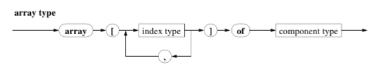
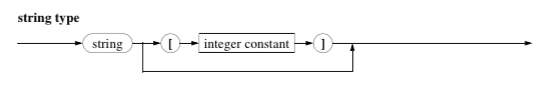
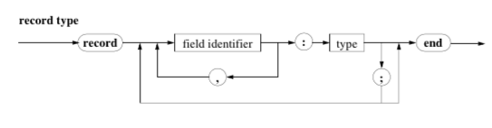

# Structured Data Types

* Complex data contstructs through the combination of simpler data constructs.

## The `Array`

* **The Array statement Syntax Diagram:**

* The `index type` has to be either an *Enumrable*, a *Subrange*, a `bool` or `char`
* The *component type* can be any type, including another array.
* The components are *indexed variable*:

````pascal
    coolDays[3] := 'Someday';
    coolDays[3 * 4 - 2] := 'Another Sunday'
````

* Explicit Array definition:

````pascal
    type
    tBlumenzahl = array [tFarbe] of integer;
````

* Implicit Typ definition:

````pascal
    var
    Feld : array [1..100] of integer;
````

## The `String`

* **The Array statement Syntax Diagram:**

* Strings are not defined in standard pascal. (we refer to turbo-pascal here)
* The *integer constant* defines the length of the string, and in most implimentations can't exceed 255 characters.
* `length` is a predefined function. and so:

````pascal
    program StringTest (input, output);
        { Showing how length works }
        const
        MAX = 100;
        var
        sentance : string [MAX];
    begin
        sentance := 'Short sentance!';
        writeln (Zeichenkette);
        writeln ('The third character is: ', sentance[3]);
        write ('The last character is: ');
        writeln (sentance[length (sentance)])
    end. { StringTest }

    {
        This would output:
        Short Sentance!
        The third character is o
        The last character is !
    }
````

## The `record`

* **The Record statement Syntax Diagram:**

* For example:

````pascal

    type
    tHour = 0..23;
    tMinSec = 0..59;
    tTime = record
                h : tHour;
                m,
                s : tMinSec
            end; { tTime }
````

* The identifiers whithin a record need to be unique. (h, m, s)
* The `record` selector looks like this:

````pascal
    Start.h := 12;
    Start.m := 53;
    Start.s := 0
````

