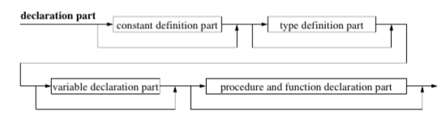
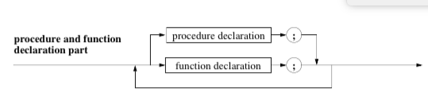
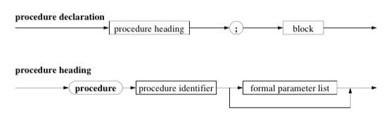
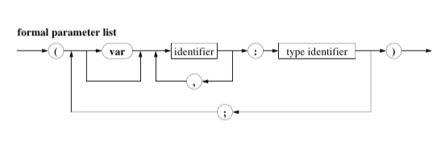

# Procedures

## Parameters

* A procedure is its own statement, and not part of a statement such as a function.
* **The Procedure Decleration Part Syntax Diagram:**




* There are two ways to pass parameters to a procedure:
    * call-by-value
        * The actual value of the parameter is passed into the procedure.
        * It is bad practive to minupilute this value.
    * call-by-reference
        * Passes in the reference to the variable.
        * Prepended by the use of the `var` keyword

````pascal
    procedure solveProblem (
                        inA,
                        inB,
                        inC : real;
                    var outSolution1,
                        outSolution2 : real;
                    var outSolutionExists : boolean);
````

## Definition scope and lifetime

The following is true for both Functions and Procedures:

* All declered constants, variables, types, functions and procedures in a code block are called *local* to that code blocks
* All off the above are called *global* to blocks defined whithin the above block.
* Defining procedures inside of procedures is called nesting.

### Rules:

1. An identifier is valid inside the block it is defined in, and all subsequently nested blocks, taking into consideration rule 2.
2. If an identifier I1 is overwritten in a nested block B2, then the newly defined identifier I2 is now defined in B2, and all nested blocks inside that block. If B2 is left, then I1 becomes defined again.
3. Standardidentifiers are defined in a ficticious block surrounding all blocks. They can ofcourse be overwritten, but this shows bad programming style.


## Dynamic Block Structures

* *Static Block Structures* are the ones that are easily readable out of the code
* *Dynamic Block Structures* are created when Procedures call each other.
* Declared Variables and constants only exist as long as the block they are defined in is being called. They are created when the block is called, and are destroyed once the block finishes execution.
* Limiting the lifetime of a variable allows for efficient memmory management.

## Tips for using Procedures and Functions

1. Use it to lower code redundance
2. Even without lowering redundance, factoring code into produres increases readability, while assigning certain blocks of code meaning and purpose.
3. The use of procedures allows for reusable code. Every programmer should assemble a library of code that they use and reuse.
4. When handling large variables, using call-by-value parameters the actualy parameter is copied and recreated. This costs time and memmory. Call-by-value parameters should be faked by using `inout` parameters, but call for extra care by the programmer.


